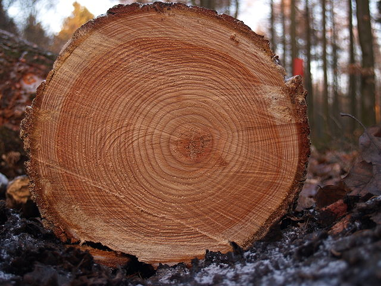
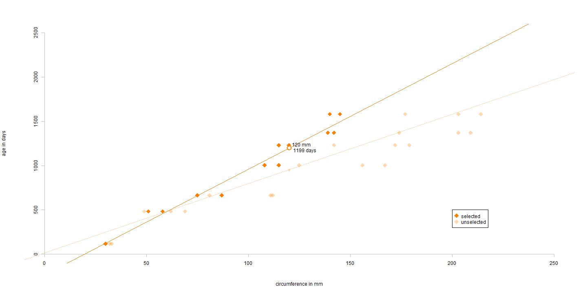

Orange Tree Prognostication
========================================================
author: Alex Robinson
date: 22nd February 2018
autosize: true
<style>
.small-code pre code {
  font-size: 1em;
}
</style>

Executive Summary
========================================================

Previously the only way to guess the age of a tree was to chop it down and
count the rings this was a very destructive way to get information.

Now based on the R Orange dataset there's an alternative approach:

*The Orange Tree Prognostication Shiny App!*
***


<small>Image from:
https://commons.wikimedia.org/wiki/File:Tree_rings.jpg</small>


The App
========================================================
class: small-code
The application takes in the circumference of the target tree and uses a
linear regression model based on the information from the Orange dataset to 
predict the age of the tree:


```r
lm(age ~ circumference, data = ora)
```

```

Call:
lm(formula = age ~ circumference, data = ora)

Coefficients:
  (Intercept)  circumference  
       16.604          7.816  
```


The application allows the user to modify the trees they want to include in the
prediction model.

So for a tree of 120mm circumference using only trees 1 & 3
we get a prediction of 1199 days as opposed
to 955 days with the 5-Tree model.

Producing a Prediction
========================================================



*The predicted age of the tree is* 
**3.3**
*years.*

Potential Improvements
========================================================

Although already a superb application there are ways in which the 
*Orange Tree Prognosticator* could be improved:
- Increase the size of the dataset.
    - Use other species of trees.
    - Collect data from more trees.
    - Collect data from a more varied time period.
    - Collect data from different areas.
- Improve the prediction algorithm.
    - It may be possible to incorporate geographic data to decide which trees
    to include in the predictive model.

